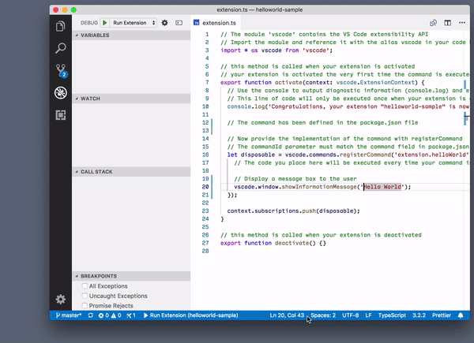
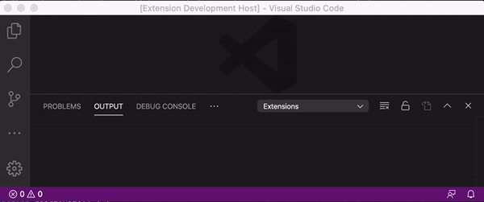
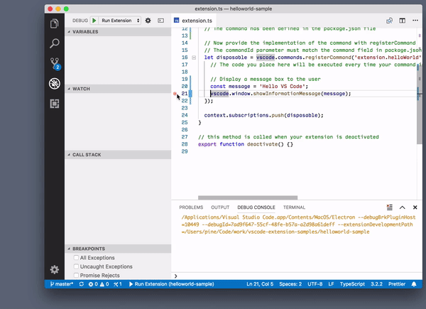

# Creating VSCode Extension


### Bit 1 - Creat boiler plate with yeoman

- Install yeoman and create code by selecting project details

  ```bash
  # install yeoman and visual studieo code generator
  npm install -g yo generator-code
  
  # create a new project boilerplate
  yo code
  # select a typescript project
  # select the name as helloworld
  ```

  - If above does not work, try installing `generator-code` locally to the parent dir.

  This will create a dir `helloworld` with following files in it : 

  ```yml
  new file:   .eslintrc.json
  new file:   .gitignore
  new file:   .vscode/extensions.json
  new file:   .vscode/launch.json
  new file:   .vscode/settings.json
  new file:   .vscode/tasks.json
  new file:   .vscodeignore
  new file:   CHANGELOG.md
  new file:   README.md
  new file:   package-lock.json
  new file:   package.json
  new file:   src/extension.ts
  new file:   src/test/runTest.ts
  new file:   src/test/suite/extension.test.ts
  new file:   src/test/suite/index.ts
  new file:   tsconfig.json
  new file:   vsc-extension-quickstart.md
  ```

### Bit 2 : Run a new window with the plugin

- Press `F5` to build the project

- This will show a new editor windo with the plugin

- Press `Cmd Shft P` to open command palette 

- Run helloworld extension

  


### Bit 3: Checkout package.json

- in package.json we see 

  ```yml
  main: "./out/extension.js",
  activationEvents: [
  	"onCommand:extension.helloWorld"
  ],
  contributes: {
  commands: [{
    "command": "extension.helloWorld",
    "title": "Hello World"
    }]
  }
  ```

  - **activationEvents**: This extension is activated when command helloworld is ran

  - **contributes** : what features this extension adds

  - **commands:** these comands will be added by the extension

    - `  "command": "extension.helloWorld"`: defins an identifier for the command

    - `"title": "Hello World"` : This shows the title of the command in **command palette**

      

  

### Bit 4: Checkout extension.ts

- Now take a look in `src/extension.ts`, which compiles to our main file as configured in `package.json`

  ```typescript
  import * as vscode from 'vscode';
  
  // Runs when extension is activated (very first time the command is executed)
  export function activate(context: vscode.ExtensionContext) {
  	console.log('Congratulations, your extension "helloworld" is now active!');
  
  	// Create handler for command defined in package.json file
  	const disposable = vscode.commands.registerCommand('extension.helloWorld', () => {
  		// Runs every single time comand is executed
  
  		// Display a message box to the user
  		vscode.window.showInformationMessage('Hello World!');
  	});
  	context.subscriptions.push(disposable);
  }
  
  // called when extension is deactivated
  export function deactivate() {
    
  }
  ```

  - We defined followign methods for the extensions

    - `activate` : runs only once when command is run for first time
    - `deactivate` : runs when extension is deactivated

  - `		vscode.window.showInformationMessage('Hello World!');` shows the window with title "Hello Word !"

    


### Bit 4 : Checkout `vscode.window.showInformationMessage` API

- In the extension.ts, press Cmd and click on `		vscode.window.showInformationMessage`

  ```typescript
  /**
  * Show an information message to users. Optionally provide an array of items which will be presented as clickable buttons.
  * @param message The message to show.
  * @param items A set of items that will be rendered as actions in the message.
  * @return A thenable that resolves to the selected item or `undefined` when being dismissed.
  */
  export function showInformationMessage(message: string, ...items: string[]): Thenable<string | undefined>;
  
  ```

- Based on the doc, lets modify our `extension.ts` as following : 

  ```typescript
  // Display a message box to the user
  vscode.window.showInformationMessage(
    'Hello World!',
    "Options 1 - Say back hello",
    "Options 2 - Ignore the hello",
    "Options 3 - Checkout this option",
  ).then(chosen => {
  	vscode.window.showInformationMessage(`You chose : ${chosen || 'nothing'}`);
  });
  ```

- Now runt the project again and select command from command palette: 

  


### Bit 5 : Debug extension

- You can add breakpoints in gutter and run the the extension to enable debugging

  

